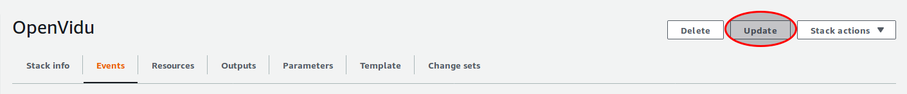
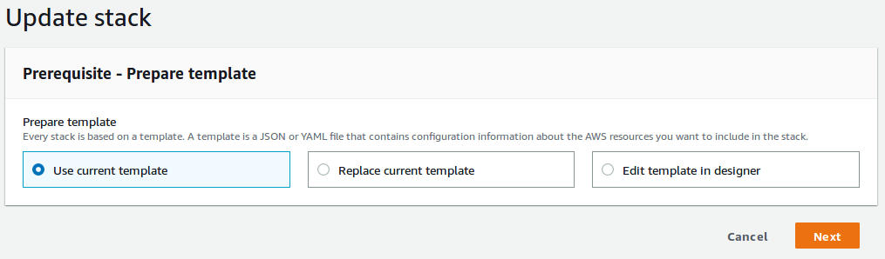
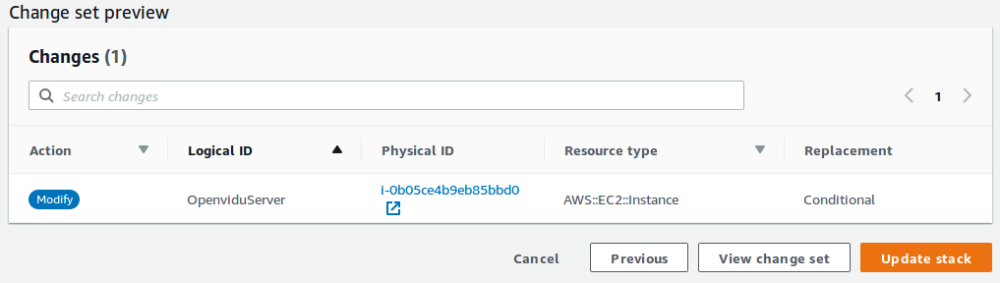
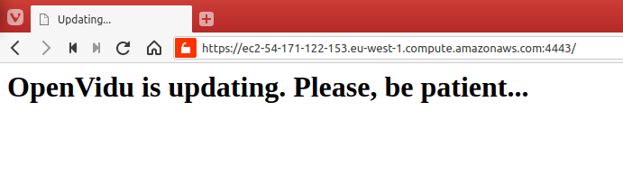

# Updating process

## Manual process

If you want to update OpenVidu follow this steps:

> Warning: during the update process there will be downtime of services. Warn your users in advance.

### 1. Connect to the instance:

`$ ssh -i RSA_KEY ubuntu@INSTANCE_IP`

replace:

* `RSA_KEY` for the PATH to your rsa key file.
* `INSTANCE_IP` for the instance IP, you can get this information from the AWS EC2 dashboard.

### 2. Stop services:

To stop the services:

#### 2.1 Kurento Media Server

`$ sudo systemctl stop kurento-media-server`

#### 2.2 OpenVidu

`$ sudo supervisorctl stop openvidu-server`

If you try to access the service right now you will recived a **HTTP 502 Bad Gateway** error from the server.

### 3. Update Kurento Media Server

Versions of Kurento Media Server and OpenVidu must match for compatibility reasons. For example if you want to update to OpenVidu 2.11.0 you need to install Kurento Media Server 6.11.0.

Export the OpenVidu version you would like to install:

`$ export OPENVIDU_VERSION=2.11.0`

To check which Kurento Media Server you need we've writen an API REST endpoint:

`$ KMS_VERSION=$(curl --silent https://oudzlg0y3m.execute-api.eu-west-1.amazonaws.com/v1/ov_kms_matrix?ov=${OPENVIDU_VERSION} | jq --raw-output '.[0] | .kms')`

Remove completely Kurento Media Server

`$ sudo apt-get remove --auto-remove --yes kurento-media-server`

Update the sources file for Kurento Media Server:

`$ echo deb [arch=amd64] http://ubuntu.openvidu.io/${KMS_VERSION} xenial kms6 | sudo tee /etc/apt/sources.list.d/kurento.list`

Reload the repository indexes

`$ sudo apt-get update`

And install Kurento Media Server

`$ sudo apt-get install --yes -o Dpkg::Options::="--force-confold" kurento-media-server`

`force-confold` is an option to keep the local config files if the new ones have changes, though, dpkg won't ask you if you want to keep the local ones or install the new ones.

### 4. Update OpenVidu Server

To update OpenVidu Server you only need to download the jar file from our GitHub repository:

`$ sudo wget -O /opt/openvidu/openvidu-server.jar https://github.com/OpenVidu/openvidu/releases/download/v${OPENVIDU_VERSION}/openvidu-server-${OPENVIDU_VERSION}.jar`

### 5. Start the services again

```
$ sudo systemctl start kurento-media-server`
$ sudo supervisorctl start openvidu-server`
```

Just after a few seconds you'll be able to connect to the app again.

## Automatic Updated

> Warning: This is a Work In Progress

Since OpenVidu 2.11.0 you can upgrade the OpenVidu Server from the CloudFormation dashboard. There's a new parameter in the template you can edit to trigger an update of the stack.

From the CloudFormation Dashboard select the stack you want to update and click **Update**



Then we choose **Use current template** and click **Next**



You'll see the parameters you introduced the first time you deployed OpenVidu. Look for **OpenVidu Version** within **OpenVidu Configuration**


And fill with the desired version.

Now the steps are the same as then ones for deploying from scratch. So, a couple click will set you in the review section and we'll have a look at the page bottom where CloudFormation will warn us that the update process will provoke a downtime of services:



What that means is the instance will be stopped and started again to apply the changes.

The update process take a few minutes, even though the stack said **Update completed**, you have to wait a bit more. During the update process you'll see a menssage if you try to access the application:



Because of the instance is stopped and started again the IP and DNS have changed, you can get the new ones in CloudFormation Dashboard -> Output. If you are using custom DNS like in Own SSL Certificate or Lets Encrypt you don't have to worry about this at all.